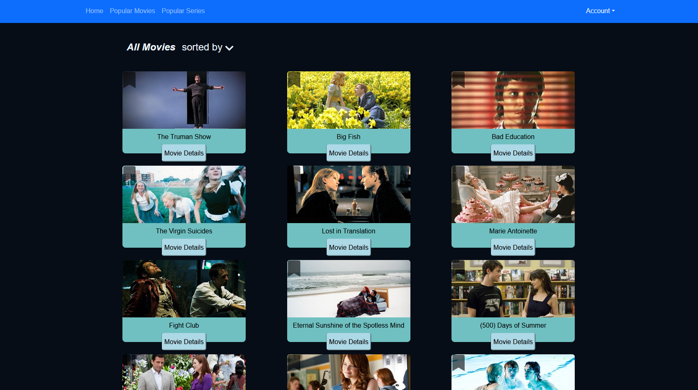

# MovieDB Website - React Project

The MovieDB Website is a web application built using React that allows users to explore, search, and discover information about movies. Whether you're a film buff or just looking for something to watch, this app provides a platform to browse through a vast collection of movies and access details about them.

# Features

    Browse and Search: Explore a wide range of movies from various genres. Utilize the search functionality to find specific movies by rating.

    Movie Details: Access detailed information about each movie, including its title,description,  release year and user ratings.

    User Favorites: Create an account to mark movies as favorites and build your own personalized watchlist.

    Responsive Design: Enjoy a seamless experience across different devices, ensuring easy navigation and readability.

# Technologies Used

    Frontend: React.js for building a dynamic and interactive user interface.

    API Integration: Utilize APIs like The Movie Database (TMDb) API to fetch movie information and images.

    Styling: CSS for designing a visually appealing and user-friendly interface.

# Installation and Usage

To run the MovieDB Website locally, follow these steps:

    Clone this repository to your local machine.
    Navigate to the project directory and install dependencies using npm install.
    Sign up on The Movie Database (TMDB) website to get an API key.
    Create a .env file in the project directory and add your API key.
    Run the development server using npm start.
    Access the app in your browser at http://localhost:3000.